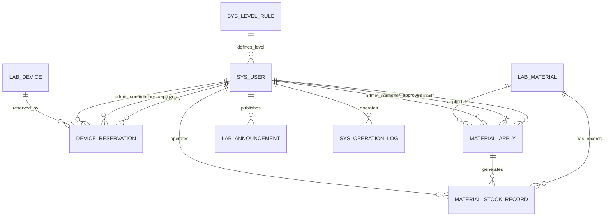

# 数据库表设计 ER 初稿 v0.1

## 1. 设计说明

本数据库设计面向单实验室版本，默认系统只管理一个实验室，不做多实验室数据隔离。

数据库设计目标：

1. 支持学生、教师、实验室管理员、系统管理员四类用户。
2. 支持角色等级与申请规则配置。
3. 支持普通设备、贵重设备、核心设备的预约审批。
4. 支持普通耗材、特殊耗材的领用审批。
5. 支持耗材库存扣减、库存流水和库存预警。
6. 支持公告发布。
7. 支持系统级操作日志。
8. 支持后续扩展多实验室、通知、导出、扫码签到等功能。

建议数据库：MySQL 8。

建议主键类型：`BIGINT AUTO_INCREMENT`。

建议时间字段类型：`DATETIME`。

建议金额/比例字段类型：`DECIMAL`。

建议状态、角色、等级字段使用 `TINYINT` 或 `VARCHAR`。为了便于后端枚举管理，本设计优先推荐 `TINYINT` 编码。

---

## 2. 核心实体列表

|序号|表名|中文名|说明|
|---|---|---|---|
|1|sys_user|用户表|存储学生、教师、实验室管理员、系统管理员|
|2|sys_level_rule|角色等级与申请规则表|存储不同等级对应的申请/审批规则|
|3|lab_info|实验室基础信息表|单实验室基础信息配置|
|4|lab_device|设备表|存储实验室设备信息|
|5|device_reservation|设备预约表|存储设备预约、教师审批、管理员确认流程|
|6|lab_material|耗材表|存储耗材基础信息和库存|
|7|material_apply|耗材领用申请表|存储耗材申请、教师审批、管理员确认流程|
|8|material_stock_record|耗材库存流水表|记录耗材入库、出库、调整记录|
|9|lab_announcement|公告表|存储实验室公告|
|10|sys_operation_log|操作日志表|存储系统操作审计日志|

---

## 3. ER 关系概览



---

## 4. 枚举编码建议

### 4.1 用户角色 role

|编码|枚举|说明|
|---|---|---|
|0|SYS_ADMIN|系统管理员|
|1|LAB_ADMIN|实验室管理员|
|2|STUDENT|学生|
|3|TEACHER|教师|

### 4.2 用户等级 level

|编码|说明|
|---|---|
|0|系统管理员|
|1|实验室管理员|
|2|学生|
|3|讲师|
|4|副教授|
|5|教授|

### 4.3 设备等级 device_level

|编码|说明|
|---|---|
|0|普通设备|
|1|贵重设备|
|2|核心设备|

### 4.4 设备状态 status

|编码|说明|
|---|---|
|0|可预约|
|1|维护中|
|2|停用|

说明：“使用中”不建议作为设备表中的固定状态，应由当前时间和已通过预约记录动态判断。

### 4.5 耗材危险等级 dangerous_level

|编码|说明|
|---|---|
|0|普通耗材|
|1|危险耗材|

### 4.6 预约/申请状态 status

|编码|枚举|说明|
|---|---|---|
|0|PENDING_ADMIN|待实验室管理员审批|
|1|PENDING_TEACHER|待教师审批|
|2|TEACHER_APPROVED|教师已通过，待实验室管理员确认|
|3|APPROVED|实验室管理员最终确认通过，申请正式生效|
|4|REJECTED|已被教师或实验室管理员驳回|
|5|CANCELLED|用户已取消|
|6|FINISHED|已完成|

### 4.7 耗材库存变更类型 change_type

|编码|说明|
|---|---|
|0|入库|
|1|出库|
|2|调整|

### 4.8 公告状态 status

|编码|说明|
|---|---|
|0|草稿|
|1|已发布|
|2|已下架|

---

## 5. 数据表设计

---

## 5.1 用户表：sys_user

### 表说明

存储系统所有用户，包括学生、教师、实验室管理员和系统管理员。

### 字段设计

| 字段名         | 类型           | 约束                 | 说明                                   |
| ----------- | ------------ | ------------------ | ------------------------------------ |
| id          | BIGINT       | PK, AUTO_INCREMENT | 用户 ID                                |
| user_code   | VARCHAR(50)  | NOT NULL, UNIQUE   | 用户业务编号，例如 STU20260001、TEA20260001    |
| username    | VARCHAR(50)  | NOT NULL, UNIQUE   | 登录账号                                 |
| password    | VARCHAR(255) | NOT NULL           | 加密后的密码                               |
| real_name   | VARCHAR(50)  | NOT NULL           | 真实姓名                                 |
| role        | TINYINT      | NOT NULL           | 用户角色：0系统管理员，1实验室管理员，2学生，3教师          |
| level       | TINYINT      | NOT NULL           | 用户等级：0系统管理员，1实验室管理员，2学生，3讲师，4副教授，5教授 |
| phone       | VARCHAR(20)  | NULL               | 联系电话                                 |
| email       | VARCHAR(100) | NULL               | 邮箱                                   |
| status      | TINYINT      | NOT NULL DEFAULT 1 | 状态：0禁用，1启用                           |
| create_time | DATETIME     | NOT NULL           | 创建时间                                 |
| update_time | DATETIME     | NOT NULL           | 更新时间                                 |

### 关键约束

1. `username` 唯一。
2. `user_code` 唯一。
3. 教师用户 `role = 3` 时，`level` 只能为 3、4、5。
4. 学生用户 `role = 2` 时，`level = 2`。
5. 实验室管理员 `role = 1` 时，`level = 1`。
6. 系统管理员 `role = 0` 时，`level = 0`。

### 建议索引

|索引名|字段|
|---|---|
|uk_user_code|user_code|
|uk_username|username|
|idx_role|role|
|idx_level|level|
|idx_status|status|

---

## 5.2 角色等级与申请规则表：sys_level_rule

### 表说明

存储不同等级对应的设备申请/审批范围、耗材申请/审批比例和危险耗材权限。

### 字段设计

|字段名|类型|约束|说明|
|---|---|---|---|
|id|BIGINT|PK, AUTO_INCREMENT|规则 ID|
|level|TINYINT|NOT NULL, UNIQUE|等级|
|level_name|VARCHAR(50)|NOT NULL|等级名称，例如学生、讲师、副教授、教授|
|role|TINYINT|NOT NULL|对应角色|
|max_device_level|TINYINT|NULL|该等级可申请或可审批的最高设备等级|
|max_material_percentage|DECIMAL(5,4)|NULL|最大耗材比例，例如 0.0200 表示 2%|
|max_dangerous_level|TINYINT|NULL|最高耗材危险等级，0普通，1危险|
|description|VARCHAR(255)|NULL|规则说明|
|create_time|DATETIME|NOT NULL|创建时间|
|update_time|DATETIME|NOT NULL|更新时间|

### 默认规则建议

|level|level_name|role|max_device_level|max_material_percentage|max_dangerous_level|
|---|---|---|---|---|---|
|0|系统管理员|0|NULL|NULL|NULL|
|1|实验室管理员|1|NULL|NULL|NULL|
|2|学生|2|0|0.0200|0|
|3|讲师|3|1|0.0500|0|
|4|副教授|3|1|0.0700|1|
|5|教授|3|2|0.1000|1|

### 业务说明

1. 对学生来说，规则用于判断“是否允许直接申请”。
2. 对教师来说，规则用于判断“是否具备审批资格”。
3. 系统管理员和实验室管理员不参与设备预约和耗材申请额度计算，因此相关字段可为空。
4. 百分比额度计算公式：`额度上限 = 当前申请耗材 current_stock × max_material_percentage`，计算结果向下取整。
5. 如果计算结果小于 1，则普通申请额度按 1 个单位处理；如果库存为 0，则不允许申请。

---

## 5.3 实验室基础信息表：lab_info

### 表说明

单实验室基础信息表。当前版本只需要一条记录。

### 字段设计

|字段名|类型|约束|说明|
|---|---|---|---|
|id|BIGINT|PK, AUTO_INCREMENT|实验室 ID|
|lab_name|VARCHAR(100)|NOT NULL|实验室名称|
|description|TEXT|NULL|实验室介绍|
|open_start_time|TIME|NULL|默认开放开始时间|
|open_end_time|TIME|NULL|默认开放结束时间|
|notice|TEXT|NULL|实验室使用须知|
|status|TINYINT|NOT NULL DEFAULT 1|状态：0停用，1启用|
|create_time|DATETIME|NOT NULL|创建时间|
|update_time|DATETIME|NOT NULL|更新时间|

### 业务说明

1. 当前版本为单实验室系统，默认只维护一条实验室信息。
2. 后续扩展多实验室时，可以在设备表、耗材表、用户表中增加 `lab_id` 字段。

---

## 5.4 设备表：lab_device

### 表说明

存储实验室设备基础信息。

### 字段设计

| 字段名                    | 类型           | 约束                 | 说明               |
| ---------------------- | ------------ | ------------------ | ---------------- |
| id                     | BIGINT       | PK, AUTO_INCREMENT | 设备 ID            |
| device_code            | VARCHAR(50)  | NOT NULL, UNIQUE   | 设备编号             |
| device_name            | VARCHAR(100) | NOT NULL           | 设备名称             |
| category               | VARCHAR(50)  | NULL               | 设备分类             |
| device_level           | TINYINT      | NOT NULL           | 设备等级：0普通，1贵重，2核心 |
| status                 | TINYINT      | NOT NULL DEFAULT 0 | 状态：0可预约，1维护中，2停用 |
| image_url              | VARCHAR(255) | NULL               | 设备图片             |
| description            | TEXT         | NULL               | 设备描述             |
| required_teacher_level | TINYINT      | NULL               | 预约该设备所需最低教师审批等级  |
| notice                 | TEXT         | NULL               | 使用注意事项           |
| max_reserve_duration   | INT          | NULL               | 单次最大预约时长，单位分钟    |
| min_reserve_duration   | INT          | NULL               | 单次最小预约时长，单位i分钟   |
| open_start_time        | TIME         | NULL               | 每日开放预约开始时间       |
| open_end_time          | TIME         | NULL               | 每日开放预约结束时间       |
| create_time            | DATETIME     | NOT NULL           | 创建时间             |
| update_time            | DATETIME     | NOT NULL           | 更新时间             |

### 业务说明

1. 普通设备 `device_level = 0`，通常不需要教师审批，`required_teacher_level` 可为空。
2. 贵重设备 `device_level = 1`，通常需要讲师、副教授或教授审批。
3. 核心设备 `device_level = 2`，通常需要教授审批。
4. 设备“使用中”不存入该表，由预约记录动态判断。

### 建议索引

|索引名|字段|
|---|---|
|uk_device_code|device_code|
|idx_device_level|device_level|
|idx_status|status|
|idx_category|category|

---

## 5.5 设备预约表：device_reservation

### 表说明

存储设备预约申请、教师审批、实验室管理员确认和最终状态。

### 字段设计

|字段名|类型|约束|说明|
|---|---|---|---|
|id|BIGINT|PK, AUTO_INCREMENT|预约 ID|
|reservation_no|VARCHAR(50)|NOT NULL, UNIQUE|预约编号|
|user_id|BIGINT|NOT NULL, FK|申请人 ID，关联 sys_user.id|
|device_id|BIGINT|NOT NULL, FK|设备 ID，关联 lab_device.id|
|start_time|DATETIME|NOT NULL|预约开始时间|
|end_time|DATETIME|NOT NULL|预约结束时间|
|purpose|VARCHAR(255)|NOT NULL|使用目的|
|description|TEXT|NULL|申请说明|
|status|TINYINT|NOT NULL|审批状态|
|teacher_approver_id|BIGINT|NULL, FK|教师审批人 ID，关联 sys_user.id|
|admin_approver_id|BIGINT|NULL, FK|实验室管理员审批人 ID，关联 sys_user.id|
|teacher_approve_opinion|VARCHAR(255)|NULL|教师审批意见|
|teacher_approve_time|DATETIME|NULL|教师审批时间|
|admin_approve_opinion|VARCHAR(255)|NULL|实验室管理员审批意见|
|admin_approve_time|DATETIME|NULL|实验室管理员审批时间|
|reject_reason|VARCHAR(255)|NULL|驳回原因|
|create_time|DATETIME|NOT NULL|创建时间|
|update_time|DATETIME|NOT NULL|更新时间|

### 业务说明

1. 普通设备预约进入 `PENDING_ADMIN`。
2. 贵重设备和核心设备预约进入 `PENDING_TEACHER`。
3. 教师通过后，状态变为 `TEACHER_APPROVED`。
4. 实验室管理员最终确认后，状态变为 `APPROVED`。
5. 用户取消后，状态变为 `CANCELLED`。
6. 使用结束后，状态可变为 `FINISHED`。
7. 只有 `APPROVED` 和 `TEACHER_APPROVED` 等会影响预约冲突判断，具体可由业务规则控制。
8. 普通设备预约无需填写 `teacher_approver_id`。
9. 贵重设备和核心设备预约必须填写 `teacher_approver_id`。

### 冲突校验建议

同一设备在同一时间段内不能存在冲突预约。

冲突判断条件：

```text
device_id 相同
AND status IN (PENDING_ADMIN, PENDING_TEACHER, TEACHER_APPROVED, APPROVED)
AND start_time < 新预约结束时间
AND end_time > 新预约开始时间
```

说明：

1. `REJECTED`、`CANCELLED` 不参与冲突判断。
2. 是否让 `PENDING_TEACHER`、`PENDING_ADMIN` 参与冲突判断，取决于是否允许多个待审批申请竞争同一时段。建议参与冲突判断，避免大量重复申请。

### 建议索引

|索引名|字段|
|---|---|
|uk_reservation_no|reservation_no|
|idx_user_id|user_id|
|idx_device_time|device_id, start_time, end_time|
|idx_status|status|
|idx_teacher_approver|teacher_approver_id|
|idx_admin_approver|admin_approver_id|

---

## 5.6 耗材表：lab_material

### 表说明

存储耗材基础信息、库存、预警值和危险等级。

### 字段设计

|字段名|类型|约束|说明|
|---|---|---|---|
|id|BIGINT|PK, AUTO_INCREMENT|耗材 ID|
|material_code|VARCHAR(50)|NOT NULL, UNIQUE|耗材编号|
|material_name|VARCHAR(100)|NOT NULL|耗材名称|
|category|VARCHAR(50)|NULL|耗材分类|
|specification|VARCHAR(100)|NULL|规格型号|
|dangerous_level|TINYINT|NOT NULL DEFAULT 0|危险等级：0普通，1危险|
|unit|VARCHAR(20)|NOT NULL|单位|
|current_stock|INT|NOT NULL DEFAULT 0|当前库存|
|warning_stock|INT|NOT NULL DEFAULT 0|库存预警值|
|location|VARCHAR(100)|NULL|存放位置|
|supplier|VARCHAR(100)|NULL|供应商|
|status|TINYINT|NOT NULL DEFAULT 1|状态：0停用，1正常|
|create_time|DATETIME|NOT NULL|创建时间|
|update_time|DATETIME|NOT NULL|更新时间|

### 业务说明

1. `current_stock = 0` 时，不允许提交耗材申请。
2. `dangerous_level = 0` 且申请数量未超额，为普通耗材申请。
3. `dangerous_level = 1` 或申请数量超额，为特殊耗材申请。
4. 库存小于等于 `warning_stock` 时，触发库存预警。
5. 当前采用百分比控制额度，不在耗材表中设置固定申请上限。

### 建议索引

|索引名|字段|
|---|---|
|uk_material_code|material_code|
|idx_material_name|material_name|
|idx_category|category|
|idx_dangerous_level|dangerous_level|
|idx_status|status|

---

## 5.7 耗材领用申请表：material_apply

### 表说明

存储耗材领用申请、教师审批、实验室管理员确认和申请状态。

### 字段设计

|字段名|类型|约束|说明|
|---|---|---|---|
|id|BIGINT|PK, AUTO_INCREMENT|申请 ID|
|apply_no|VARCHAR(50)|NOT NULL, UNIQUE|申请编号|
|user_id|BIGINT|NOT NULL, FK|申请人 ID，关联 sys_user.id|
|material_id|BIGINT|NOT NULL, FK|耗材 ID，关联 lab_material.id|
|apply_quantity|INT|NOT NULL|申请数量|
|purpose|VARCHAR(255)|NOT NULL|申请用途|
|description|TEXT|NULL|申请说明|
|apply_type|TINYINT|NOT NULL|申请类型：0普通，1特殊|
|status|TINYINT|NOT NULL|审批状态|
|teacher_approver_id|BIGINT|NULL, FK|教师审批人 ID，关联 sys_user.id|
|admin_approver_id|BIGINT|NULL, FK|实验室管理员审批人 ID，关联 sys_user.id|
|teacher_approve_opinion|VARCHAR(255)|NULL|教师审批意见|
|teacher_approve_time|DATETIME|NULL|教师审批时间|
|admin_approve_opinion|VARCHAR(255)|NULL|实验室管理员审批意见|
|admin_approve_time|DATETIME|NULL|实验室管理员审批时间|
|reject_reason|VARCHAR(255)|NULL|驳回原因|
|create_time|DATETIME|NOT NULL|创建时间|
|update_time|DATETIME|NOT NULL|更新时间|

### 业务说明

1. 普通耗材申请：`apply_type = 0`，状态进入 `PENDING_ADMIN`。
2. 特殊耗材申请：`apply_type = 1`，状态进入 `PENDING_TEACHER`。
3. 教师审批通过后，状态变为 `TEACHER_APPROVED`。
4. 实验室管理员确认后，状态变为 `APPROVED`，并扣减库存。
5. 驳回后，状态变为 `REJECTED`。
6. 普通耗材申请无需填写 `teacher_approver_id`。
7. 特殊耗材申请必须填写 `teacher_approver_id`。
8. 实验室管理员最终确认前，需要再次校验库存是否充足。

### 百分比额度判断

系统根据申请人等级对应的 `max_material_percentage` 判断是否超额：

```text
quota = floor(material.current_stock × level_rule.max_material_percentage)
```

规则：

1. 如果 `current_stock = 0`，不允许提交申请。
2. 如果 `quota < 1`，普通申请额度按 1 个单位处理。
3. 如果 `apply_quantity <= quota` 且 `dangerous_level = 0`，则为普通申请。
4. 如果 `apply_quantity > quota` 或 `dangerous_level = 1`，则为特殊申请。

### 建议索引

|索引名|字段|
|---|---|
|uk_apply_no|apply_no|
|idx_user_id|user_id|
|idx_material_id|material_id|
|idx_apply_type|apply_type|
|idx_status|status|
|idx_teacher_approver|teacher_approver_id|
|idx_admin_approver|admin_approver_id|

---

## 5.8 耗材库存流水表：material_stock_record

### 表说明

记录耗材库存的每一次变化，包括入库、出库和手动调整。

### 字段设计

|字段名|类型|约束|说明|
|---|---|---|---|
|id|BIGINT|PK, AUTO_INCREMENT|流水 ID|
|material_id|BIGINT|NOT NULL, FK|耗材 ID，关联 lab_material.id|
|change_type|TINYINT|NOT NULL|变更类型：0入库，1出库，2调整|
|change_quantity|INT|NOT NULL|变化数量|
|before_quantity|INT|NOT NULL|变更前库存|
|after_quantity|INT|NOT NULL|变更后库存|
|operator_id|BIGINT|NOT NULL, FK|操作人 ID，关联 sys_user.id|
|related_apply_id|BIGINT|NULL, FK|关联耗材领用申请 ID，关联 material_apply.id|
|remark|VARCHAR(255)|NULL|备注|
|create_time|DATETIME|NOT NULL|创建时间|

### 业务说明

1. 耗材申请通过后扣减库存时，生成出库流水。
2. 实验室管理员手动入库时，生成入库流水。
3. 实验室管理员手动调整库存时，生成调整流水。
4. 库存流水只记录事实，不参与审批流。

### 建议索引

|索引名|字段|
|---|---|
|idx_material_id|material_id|
|idx_operator_id|operator_id|
|idx_related_apply|related_apply_id|
|idx_create_time|create_time|

---

## 5.9 公告表：lab_announcement

### 表说明

存储实验室公告，包括开放时间调整、设备维护通知、预约规则说明等。

### 字段设计

|字段名|类型|约束|说明|
|---|---|---|---|
|id|BIGINT|PK, AUTO_INCREMENT|公告 ID|
|title|VARCHAR(100)|NOT NULL|公告标题|
|content|TEXT|NOT NULL|公告内容|
|publisher_id|BIGINT|NOT NULL, FK|发布人 ID，关联 sys_user.id|
|status|TINYINT|NOT NULL DEFAULT 0|状态：0草稿，1已发布，2已下架|
|create_time|DATETIME|NOT NULL|创建时间|
|update_time|DATETIME|NOT NULL|更新时间|

### 业务说明

1. 只有实验室管理员可以发布、编辑、下架公告。
2. 学生和教师只能查看已发布公告。
3. 系统管理员不发布公告。

### 建议索引

|索引名|字段|
|---|---|
|idx_publisher_id|publisher_id|
|idx_status|status|
|idx_create_time|create_time|

---

## 5.10 操作日志表：sys_operation_log

### 表说明

记录系统关键操作，用于系统管理员审计和异常追踪。

### 字段设计

|字段名|类型|约束|说明|
|---|---|---|---|
|id|BIGINT|PK, AUTO_INCREMENT|日志 ID|
|operator_id|BIGINT|NULL, FK|操作人 ID，关联 sys_user.id|
|operation_type|VARCHAR(50)|NOT NULL|操作类型，例如 LOGIN、CREATE_USER、APPROVE_RESERVATION|
|module_name|VARCHAR(50)|NOT NULL|所属模块|
|operation_content|TEXT|NULL|操作内容|
|ip_address|VARCHAR(50)|NULL|操作 IP|
|create_time|DATETIME|NOT NULL|操作时间|

### 业务说明

1. 实验室管理员的业务操作会被记录到操作日志中。
2. 操作日志仅允许系统管理员查看。
3. 业务记录、设备使用记录、库存流水仍由实验室管理员在业务模块中查看。
4. 登录失败、角色修改、教师等级修改等操作建议重点记录。

### 建议索引

|索引名|字段|
|---|---|
|idx_operator_id|operator_id|
|idx_operation_type|operation_type|
|idx_module_name|module_name|
|idx_create_time|create_time|

---

## 6. 表关系说明

### 6.1 用户与角色等级规则

```text
sys_user.level -> sys_level_rule.level
```

说明：

1. 用户表通过 `level` 关联等级规则。
2. 学生、教师、实验室管理员、系统管理员都可以有等级。
3. 真正用于申请或审批规则判断的是 `sys_level_rule`。

---

### 6.2 用户与设备预约

```text
sys_user.id -> device_reservation.user_id
sys_user.id -> device_reservation.teacher_approver_id
sys_user.id -> device_reservation.admin_approver_id
```

说明：

1. 一个用户可以提交多个设备预约。
2. 一个教师可以审批多个设备预约。
3. 一个实验室管理员可以确认多个设备预约。

---

### 6.3 设备与设备预约

```text
lab_device.id -> device_reservation.device_id
```

说明：

1. 一个设备可以有多条预约记录。
2. 设备预约冲突校验依赖 `device_id + start_time + end_time + status`。

---

### 6.4 用户与耗材申请

```text
sys_user.id -> material_apply.user_id
sys_user.id -> material_apply.teacher_approver_id
sys_user.id -> material_apply.admin_approver_id
```

说明：

1. 一个用户可以提交多个耗材申请。
2. 一个教师可以审批多个特殊耗材申请。
3. 一个实验室管理员可以确认多个耗材申请。

---

### 6.5 耗材与耗材申请

```text
lab_material.id -> material_apply.material_id
```

说明：

1. 一个耗材可以被多次申请。
2. 申请通过后会影响该耗材库存。

---

### 6.6 耗材与库存流水

```text
lab_material.id -> material_stock_record.material_id
material_apply.id -> material_stock_record.related_apply_id
sys_user.id -> material_stock_record.operator_id
```

说明：

1. 一个耗材对应多条库存流水。
2. 出库流水可关联耗材申请。
3. 手动入库或调整库存时，`related_apply_id` 可以为空。

---

### 6.7 用户与公告

```text
sys_user.id -> lab_announcement.publisher_id
```

说明：

1. 一个实验室管理员可以发布多条公告。
2. 学生和教师只查看已发布公告。

---

### 6.8 用户与操作日志

```text
sys_user.id -> sys_operation_log.operator_id
```

说明：

1. 所有关键操作都可以记录操作人。
2. 操作日志仅允许系统管理员查看。

---

## 7. 关键业务校验规则

### 7.1 登录与权限

1. 用户必须登录后才能访问业务接口。
2. 学生只能访问个人申请、设备列表、耗材列表和公告。
3. 教师只能审批分配给自己的申请。
4. 实验室管理员负责设备、耗材、公告和业务确认。
5. 系统管理员负责用户、角色、等级规则和操作日志。

---

### 7.2 设备预约校验

提交设备预约时需要校验：

1. 设备存在。
2. 设备状态为可预约。
3. 当前预约时间在设备开放时间内。
4. 开始时间早于结束时间。
5. 预约时长不超过 `max_reserve_duration`。
6. 同一设备同一时间段不存在冲突预约。
7. 如果设备为贵重或核心设备，需要选择具备审批资格的教师。

---

### 7.3 教师审批资格校验

设备预约教师审批资格：

```text
teacher.level >= device.required_teacher_level
```

耗材申请教师审批资格：

```text
teacher.level 对应的 max_material_percentage 能覆盖申请数量
AND teacher.level 对应的 max_dangerous_level >= material.dangerous_level
```

---

### 7.4 耗材申请类型判断

```text
quota = floor(material.current_stock × applicant_level_rule.max_material_percentage)
```

判断规则：

1. `current_stock = 0`：不允许申请。
2. `quota < 1`：普通申请额度按 1 计算。
3. `dangerous_level = 0` 且 `apply_quantity <= quota`：普通申请。
4. `dangerous_level = 1` 或 `apply_quantity > quota`：特殊申请。

---

### 7.5 耗材出库校验

实验室管理员最终确认出库前需要再次校验：

1. 耗材仍然存在。
2. 耗材状态为正常。
3. 当前库存大于等于申请数量。
4. 审批状态符合确认条件。
5. 确认后扣减库存。
6. 扣减后生成库存流水。
7. 如果库存低于或等于预警值，则触发库存预警。

---

## 8. 数据看板统计来源

### 8.1 今日预约数量

来源表：

```text
device_reservation
```

统计条件：

```text
DATE(start_time) = CURRENT_DATE
```

---

### 8.2 待审批预约数量

来源表：

```text
device_reservation
```

统计条件：

```text
status IN (PENDING_ADMIN, PENDING_TEACHER, TEACHER_APPROVED)
```

---

### 8.3 待审批耗材申请数量

来源表：

```text
material_apply
```

统计条件：

```text
status IN (PENDING_ADMIN, PENDING_TEACHER, TEACHER_APPROVED)
```

---

### 8.4 库存预警数量

来源表：

```text
lab_material
```

统计条件：

```text
current_stock <= warning_stock
AND status = 正常
```

---

### 8.5 设备使用率排行

来源表：

```text
device_reservation
```

统计条件：

```text
status IN (APPROVED, FINISHED)
```

计算方式：

```text
设备使用总时长 = SUM(end_time - start_time)
```

---

### 8.6 耗材消耗排行

来源表：

```text
material_stock_record
```

统计条件：

```text
change_type = 出库
```

计算方式：

```text
耗材消耗数量 = SUM(change_quantity)
```

---

## 9. 建表顺序建议

建议按照以下顺序建表：

1. `sys_level_rule`
2. `sys_user`
3. `lab_info`
4. `lab_device`
5. `lab_material`
6. `device_reservation`
7. `material_apply`
8. `material_stock_record`
9. `lab_announcement`
10. `sys_operation_log`

---

## 10. 下一步开发建议

数据库表设计确认后，下一步建议继续输出：

1. MySQL 建表 SQL。
2. 后端实体类字段清单。
3. MyBatis Plus Mapper 设计。
4. API 接口清单。
5. 页面路由与前端页面清单。
6. 权限矩阵。