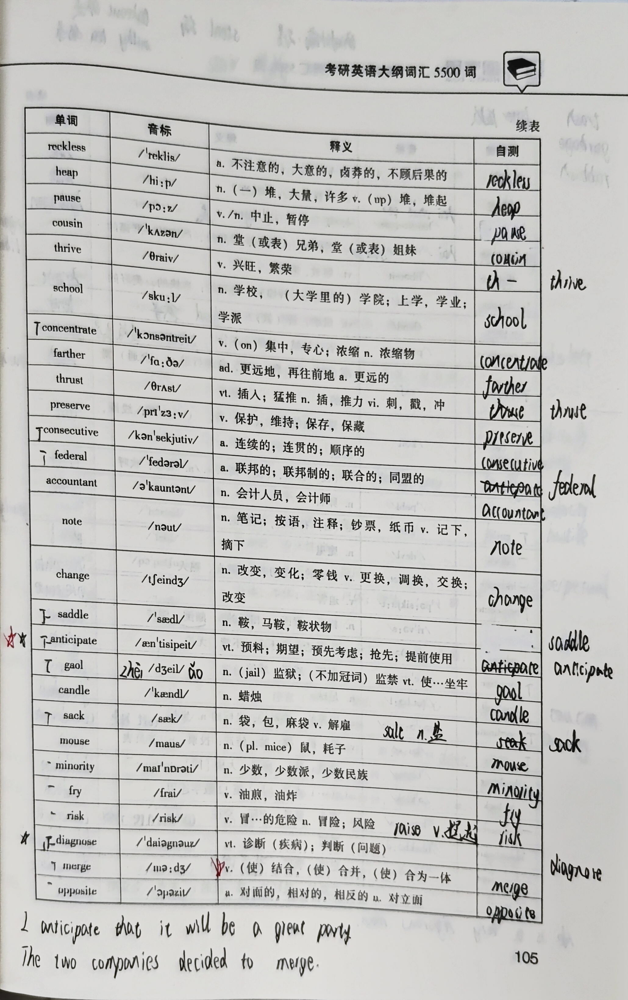

| 单词            | 音标               | 释义                           | error |
| ------------- | ---------------- | ---------------------------- | ----- |
| crazy         | /ˈkreɪzi/        | a. 疯狂的，古怪的，蠢的；(about) 狂热的    |       |
| drag          | /dræɡ/           | v. 拖，拖曳                      |       |
| panorama      | /ˌpænəˈrɑːmə/    | n. 全景，全景画；全景摄影；全景照片          |       |
| planet        | /ˈplænɪt/        | n. 行星                        |       |
| metropolitan  | /ˌmetrɔˈpɒlɪtən/ | a. 首都的，主要都市的，大城市的            |       |
| amuse         | /əˈmjuːz/        | vt. 向…提供娱乐，使…消遣；引人发笑         |       |
| debate        | /dɪˈbeɪt/        | v./n. 争论，辩论                  |       |
| front         | /frʌnt/          | a. 前面的，前部的；n. 正面，前线，战线；v. 面对 |       |
| exchange      | /ɪksˈtʃeɪndʒ/    | v./n. (for) 交换，兑换；交流，交易；交换台  |       |
| editor        | /ˈedɪtə/         | n. 编辑，编者                     |       |
| be            | /biː/            | v. 是；等于；存在；到达；来到；发生          |       |
| hungry        | /ˈhʌɡri/         | a. 饥饿的，渴望的                   |       |
| flat          | /flæt/           | a. 平坦的，扁平的，平淡的；n. 一套房间，平面    |       |
| clean         | /kliːn/          | a. 清洁的，干净的；v. 除去…污垢，把…弄干净    |       |
| most          | /məʊst/          | a. 最多的；大多数的；ad. 最，极其；n. 大多数  |       |
| step          | /step/           | n. 步；台阶，梯级；步骤；措施；v. 踏，走，举步   |       |
| pyramid       | /ˈpɪrəmɪd/       | n. 金字塔                       |       |
| barely        | /ˈbeəli/         | ad. 赤裸裸地，无掩蔽地；仅仅，勉强，几乎没有     |       |
| allowance     | /əˈlaʊəns/       | n. 补贴，津贴；零用钱；减价，折扣；允许        |       |
| tremble       | /ˈtrembl/        | n. 战栗，颤抖；v. 发抖，颤抖；摇动；焦虑      |       |
| questionnaire | /ˌkwestʃəˈneə/   | n. 调查表，问卷                    |       |
| leadership    | /ˈliːdəʃɪp/      | n. 领导                        |       |
| unify         | /ˈjuːnɪfaɪ/      | v. 使联合，统一；使相同，使一致            |       |